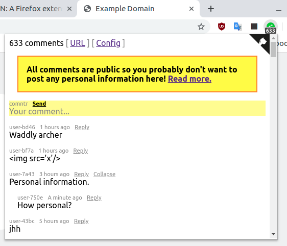

# What is this?

It's a web extension for Firefox or Chrome that allows to add comments to any URL.



More precisely, it attaches comments to SHA1 of the URL, to avoid leaking PII:

```
   +----------------------+
   | The current tab URL: |
   | http://example.com/  |
   +----------------------+
              |
              | 1. URL
              |
              v                            +------------------------------+
  +--------------------+                   | <iframe> with URL:           |
  | This web extension | ----------------->| https://comntr.io/#<tab-url> |
  +--------------------+                   +------------------------------+
              |                                            |
              | -> 2. GET /<sha1>/size                     |
              | <- 12 comments                             | -> 3. GET /<sha1>
              |                                            | <- JSON with comments
              v                                            | -> 4. POST /<sha1>
   +-----------------+                                     |    Hello World!
   | Database Server | <-----------------------------------+
   +-----------------+
```

1. The user opens a URL and the extension gets this URL via the web extension API.
2. The extension computes SHA1 of the URL and sends a `GET /<sha1>` request to the database to get the number of comments. Then this number is displayed in the extension icon's badge (just like uBlock Origin shows the number of blocked elements).
3. The user clicks on the extension icon to see the comments. The extension sends a `GET /<sha1>` request and the database returns all the comments attached to that SHA1.
4. The user adds a comment and the extension  sends a `POST /<sha1>` with the comment text.

The database server doesn't see the original URLs and uses their SHA1 instead:

```
/var/lib/comntr
  /9c1...d14        # SHA1 of "http://example.com/"
    /261...776      # SHA1 of the comment file
      Hello World!
    /829...172
      Howdy
```

The advantage of the `<iframe>` approach is that the comments can be viewed in a separate tab:

- https://comntr.github.io/#http://example.com/

The extension merely renders this page in the popup.

Involved components:
- This web extension.
- The database server: https://github.com/comntr/http-server
- Page that renders the comments: https://github.com/comntr/comntr.github.io

# Installation

For Firefox dekstop and Firefox Android use https://addons.mozilla.org/en-US/firefox/addon/comntr/. It probably works in Firefox iOS too, but I haven't checked.

The extension works in Chrome too, but it's not published to the Chrome Web Store. Why? Publishing any extension there now requires (1) a phone number, to create a gmail account and (2) a credit card, supposedly to deter spammers. However the extension can be installed manually. First, copy the files to some folder:

```
mkdir -p ~/webext/comntr
cd ~/webext/comntr
git clone https://github.com/comntr/webext .
```

Navigate to `chrome://extensions` in Chrome and find the "Developer mode" toggle in the top right corner. Use "Load unpacked" to select the `~/webext/comntr` folder. The extension should appear on the page and its icon should appear in the top right nav bar. It may be saying that there were some errors, but those are because Chrome didn't like the Firefox-specific field in `manifest.json`:

```
  "browser_specific_settings": {
    "gecko": {
      "id": "webext@comntr.io"
    }
  }
```

This error can be ignored.

# Credits

The ed25519 wasm library was taken from [nazar-pc/supercom.wasm](https://github.com/nazar-pc/supercop.wasm).

The web extension icon was made by Chanut from [www.flaticon.com](https://www.flaticon.com/free-icon/share_181551).
